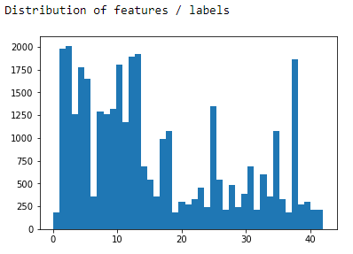
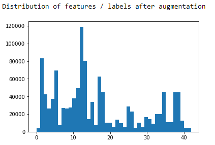
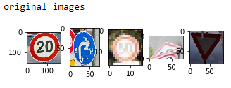
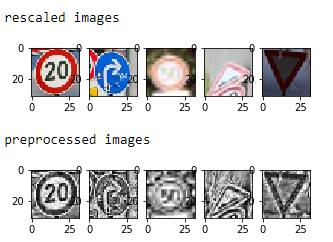

# **Traffic Sign Recognition** 

**Build a Traffic Sign Recognition Project**

The goals / steps of this project are the following:
* Load the data set (see below for links to the project data set)
* Explore, summarize and visualize the data set
* Design, train and test a model architecture
* Use the model to make predictions on new images
* Analyze the softmax probabilities of the new images
* Summarize the results with a written report

## Rubric Points
### Here I will consider the [rubric points](https://review.udacity.com/#!/rubrics/481/view) individually and describe how I addressed each point in my implementation.  

---
### Writeup / README

#### 1. Provide a Writeup / README that includes all the rubric points and how you addressed each one. You can submit your writeup as markdown or pdf. You can use this template as a guide for writing the report. The submission includes the project code.

You're reading it! and here is a link to my [project code](https://github.com/janbernloehr/CarND-Traffic-Sign-Classifier-Project/blob/master/Traffic_Sign_Classifier.ipynb)

### Data Set Summary & Exploration

#### 1. Provide a basic summary of the data set. In the code, the analysis should be done using python, numpy and/or pandas methods rather than hardcoding results manually.

I used plain to calculate summary statistics of the traffic
signs data set:

* The size of training set is 34'799 images
* The size of the validation set is 4'410
* The size of test set is 12'630 images
* The shape of a traffic sign image is 32x32
* The number of unique classes/labels in the data set is 43

#### 2. Include an exploratory visualization of the dataset.

Here are 27 randomly chosen images from the training set.

When one looks at the distribution of the images across labels, one sees that some classes are quite under represented. Here is a bar chart with the classes on the x-axis and the number of corresponding samples on the y-axis (created with matplotlib)

### Design and Test a Model Architecture

#### 1. Describe how you preprocessed the image data. What techniques were chosen and why did you choose these techniques? Consider including images showing the output of each preprocessing technique. Pre-processing refers to techniques such as converting to grayscale, normalization, etc. (OPTIONAL: As described in the "Stand Out Suggestions" part of the rubric, if you generated additional data for training, describe why you decided to generate additional data, how you generated the data, and provide example images of the additional data. Then describe the characteristics of the augmented training set like number of images in the set, number of images for each class, etc.)

As a first step, I decided to convert the images to grayscale because using color channels does not seem to add much to the network accuracy but increases training time.

I used the `rgb2gray` method from skimage to convert to grayscale which at the same time converts the image to float and hence normalizes it.

Looking at the images shows that some of them are very dark and/or have low contrast. I first used a simple gamma correction but eventually settled with the `equalize_adapthist` from skimage which performs a local, contrast limited histogram equalization.

Here are some original examples, their grayscale, and their optimized version, respectively.

Some of the traffic signs inherit symmetry - see cell 5 in my jpyter notebook for a detailed analysis of the symmetries. For example, the "Yield"-sign is horizontally symmetric

The "Speed limit (30km/h)"-sign is vertically symmetric

The "End of all speed and passing limits"-sign is symmetric when flipped horizontally and subsequently vertically.

Moreover, "Turn left ahead" becomes "Turn right ahead" when flipped horizontally (and vice versa).

This means that by simple flipping we can generate additional data for training. Doing so increases the training set size from 34'799 images to 56'368 images.

But we can do even better. The provided images are real-life images which means they are all taken from slightly different angles which results in slight squeezing, shifts, and rotating when compared to each other. We can use this to generate additional data by slightly rotating and squeezing the images ourselves. I experimented with several augmentations but eventually settled with just random rotations and random warping. The angle of rotation and the borders of the subpicture which is warped are drawn from random uniform variables.

Here are some examples, the first image is the original and the following are augmented

I decided to add for each image 20 augmented versions so that the total number of images in the training set now is 1'183'728. Here is the distribution of the extended training set.

Finally, the labels were one-hot encoded.

#### 2. Describe what your final model architecture looks like including model type, layers, layer sizes, connectivity, etc.) Consider including a diagram and/or table describing the final model.

My final model consisted of five layers, three convolutions (followed by max pooling), one fully connected layer, and the output layer. The layers were connected by RELUs. Here is a detailed description

| Layer         		|     Description	        					| 
|:---------------------:|:---------------------------------------------:| 
| Input         		| 32x32x1 Gray image   							| 
| Convolution 5x5     	| 1x1 stride, same padding, outputs 32x32x32 	|
| RELU					|												|
| Max pooling	      	| 2x2 stride,  outputs 16x16x32   				|
| Convolution 5x5     	| 1x1 stride, same padding, outputs 16x16x64 	|
| RELU					|												|
| Max pooling	      	| 2x2 stride,  outputs 8x8x64   				|
| Convolution 5x5     	| 1x1 stride, same padding, outputs 8x8x128 	|
| RELU					|												|
| Max pooling	      	| 2x2 stride,  outputs 4x4x128   				|
| Flatten			    | outputs 2'048									|
| Fully connected		| outputs 1'024        							|
| RELU					|												|
| Output        		| outputs 43        							|

#### 3. Describe how you trained your model. The discussion can include the type of optimizer, the batch size, number of epochs and any hyperparameters such as learning rate.

I sticked with Adam's optimizer from our LeNet implementation and a batch size of 128. The model was trained for 100 epochs but seemed to stop improving after ~30 epochs. Also the learning rate of `0.001` yielded the best results for me.

To avoid overfitting, I used dropout on each of the layers. Fully connected layers seem to benefit more than convolutional layers thus I chose the following keep probabilities

| Layer         		|     keep probabilities                        | 
|:---------------------:|:---------------------------------------------:| 
| Conv1         		| 0.9   							            | 
| Conv2         		| 0.8   							            | 
| Conv3         		| 0.7   							            | 
| FC             		| 0.5   							            |

Still, my first epochs resulted in low accuracy on both the training and the validation set and accuracy improved only very slow. To speed up training, I chose to add a bit of l2 regularization. After trying `lambda = 0.001` and `lambda = 0.0001`, I went for the latter.

After training for 100 epochs, I decided to use the 31st epoch since it appeared to be the one where the model stopped improving. Subsequently, I reduced the learning rate and tried to improve on that model but without success. So I just sticked with the 31st epoch of the first training.

#### 4. Describe the approach taken for finding a solution and getting the validation set accuracy to be at least 0.93. Include in the discussion the results on the training, validation and test sets and where in the code these were calculated. Your approach may have been an iterative process, in which case, outline the steps you took to get to the final solution and why you chose those steps. Perhaps your solution involved an already well known implementation or architecture. In this case, discuss why you think the architecture is suitable for the current problem.

My final model results were:
* training set accuracy of 0.98
* validation set accuracy of 0.958
* test set accuracy of 0.969

I am quite happy about the test set result which is even better than the validation result - dropout did an amazing job here.

* What was the first architecture that was tried and why was it chosen?

I started with the LeNet implementation of the class because it was already there and suited my preprocessed inputs (32x32x1). Further, it seemed to work well for classifying hand written digits which is somewhat similar to the problem at hand.

* What were some problems with the initial architecture?

The initial accuracy was 0.81 on the validation set and only a little bit better on the training set. The result stopped improving after ~50 epochs. I noticed that choosing different variances when initializing made a big difference, so I started to optimize this.

* How was the architecture adjusted and why was it adjusted? Typical adjustments could include choosing a different model architecture, adding or taking away layers (pooling, dropout, convolution, etc), using an activation function or changing the activation function. One common justification for adjusting an architecture would be due to overfitting or underfitting. A high accuracy on the training set but low accuracy on the validation set indicates over fitting; a low accuracy on both sets indicates under fitting.

Noticing that choosing different variances when initializing the weights made a big difference, I chose the xavier initializer for the weights which chooses the variance depending on the number of input nodes. Still, the initial accuracy on the training set was around 0.8 so my network was underfitting - at least in early stages of training. Then I was thinking that LeNet was constructed to classify 10 different classes and to classify 43 classes, the net may just not be big enough in terms of total number of nodes. However, I wanted to stick with five layers because this is what seemed to have worked for this kind of task comparing different architectures I found on the arxiv - even tough there exist several very deep proven architectures to attack this kind of problem. In the end, I multiplied the depth of the output layers by 4 (because 43 instead of 10 classes) and then chose the closest power of two for the depth (because I am a mathematician and have a preference for powers of two). Further, I wanted to try having one more convolutional layer. Finally, since I am always confused by valid padding, I chose same padding instead. So each of my conv-relu-maxpool blocks reduced width and height by a factor of two and thus I chose to increase depth by a factor of two. After all these changes, the initial accuracy on the validation set was 0.91 and I decided to just continue from there.

### Test a Model on New Images

#### 1. Choose five German traffic signs found on the web and provide them in the report. For each image, discuss what quality or qualities might be difficult to classify.

Here are five German traffic signs that I found on the web:

The first should be fairly easy to classify because the image is high quality and proper light - even tough the number of labels is very low for this class. The second should be already more challenging because there are several writings on the sign. The third is barely readable for me as a human. The third is two images in one - let's see what the net does here. The last one has very bad lighting.

This is how the images looked when preprocessed

#### 2. Discuss the model's predictions on these new traffic signs and compare the results to predicting on the test set. At a minimum, discuss what the predictions were, the accuracy on these new predictions, and compare the accuracy to the accuracy on the test set (OPTIONAL: Discuss the results in more detail as described in the "Stand Out Suggestions" part of the rubric).

Here are the results of the prediction:

| Image			        |     Prediction	        					| 
|:---------------------:|:---------------------------------------------:| 
| Speed limit (20km/h)      		| Speed limit (20km/h)   									| 
| Turn right ahead     			| Turn right ahead 										|
| Speed limit (50km/h)					| Speed limit (50km/h)											|
| Bumpy road	      		| Bumpy Road					 				|
| Yield			| Yield      							|

The model was able to correctly guess 5 of the 5 traffic signs, which gives an accuracy of 100%. This compares favorably to the accuracy on the test set of 96.6%

####3. Describe how certain the model is when predicting on each of the five new images by looking at the softmax probabilities for each prediction. Provide the top 5 softmax probabilities for each image along with the sign type of each probability. (OPTIONAL: as described in the "Stand Out Suggestions" part of the rubric, visualizations can also be provided such as bar charts)

For the first image, the model is quite sure that this is a 20 km/h sign (probability .999).

Precision and recall for this class are both 1.0

For the second image, the model is less sure which may be due to the writing on the sign 

| Probability         	|     Prediction	        					| 
|:---------------------:|:---------------------------------------------:| 
| .57         			| Turn right ahead   									|
| .28     				| Priority road 										|
| .10					| Keep left											|
| .01	      			| Keep right					 				|
| .01				    | Roundabout mandatory      							|

Precision for this class is 0.972 and recall is 0.99

For the third image, the model is quite sure that this is a 50 km/h sign (probability .998).

Precision for this class is 0.991 and recall is 0.992

For the fourth image, the model is quite sure that this is a bumpy road sign (probability .997).

Precision for this class is 0.958 and recall is 0.958

For the fifth image, the model is quite sure that this is a Yield sign (probability .999).

Precision for this class is 0.98 and recall is 0.997

### (Optional) Visualizing the Neural Network (See Step 4 of the Ipython notebook for more details)
####1. Discuss the visual output of your trained network's feature maps. What characteristics did the neural network use to make classifications?

